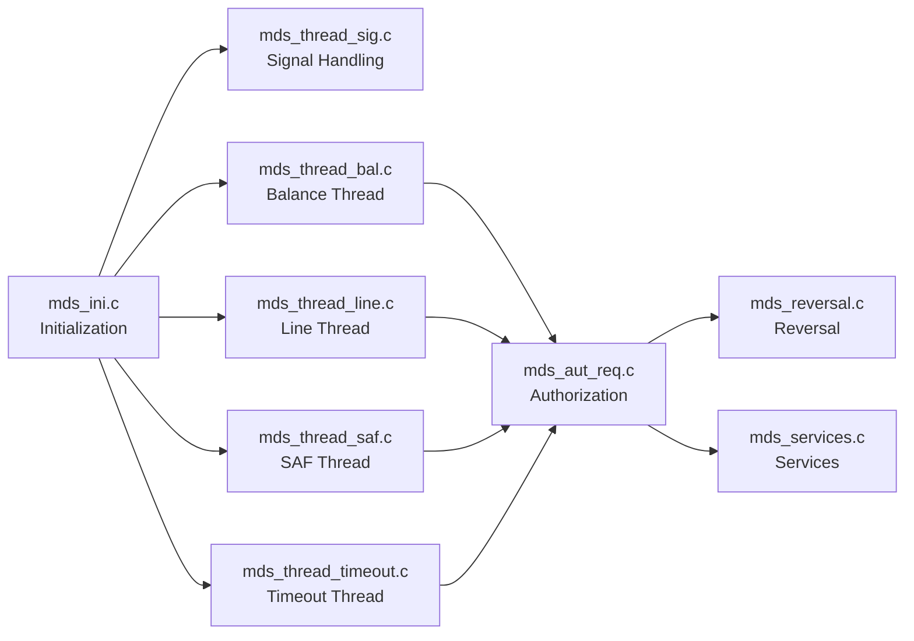
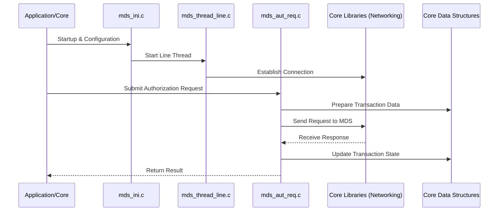

# MDS Interface Module Documentation

## Introduction

The **MDS Interface** module is responsible for managing communication and transaction processing with the MDS (Multi-Data Switch) network within the payment switching system. It provides the necessary logic to handle authorization requests, reversals, balance inquiries, line management, SAF (Store and Forward) processing, and service requests specific to the MDS protocol. The module is designed to operate as part of a larger, modular payment switching architecture, interfacing with both core libraries and other network modules.

## Core Functionality

The MDS Interface module implements the following primary functions:

- **Authorization Requests**: Handles incoming and outgoing authorization requests to/from the MDS network.
- **Reversal Processing**: Manages transaction reversals in case of errors or cancellations.
- **Balance Inquiry**: Processes balance inquiry requests and responses.
- **Line Management**: Maintains and monitors communication lines to the MDS network.
- **SAF (Store and Forward) Processing**: Ensures transaction reliability by storing transactions when the network is unavailable and forwarding them when connectivity is restored.
- **Service Requests**: Handles miscellaneous service requests as defined by the MDS protocol.
- **Threaded Operation**: Utilizes dedicated threads for balance, line, SAF, and timeout management to ensure high concurrency and reliability.
- **Signal Handling**: Manages process signals for safe startup, shutdown, and runtime control.

## Module Components

The MDS Interface consists of the following core components:

- `mds_aut_req.c`: Handles authorization requests (uses `timeval`)
- `mds_ini.c`: Module initialization and signal handling (uses `sigset_t`)
- `mds_reversal.c`: Handles transaction reversals (uses `timeval`)
- `mds_services.c`: Processes service requests (uses `timeval`)
- `mds_thread_bal.c`: Thread for balance inquiries (uses `timeval`)
- `mds_thread_line.c`: Thread for line management (uses `timeval`)
- `mds_thread_saf.c`: Thread for SAF processing (uses `timeval`)
- `mds_thread_sig.c`: Thread for signal handling (uses `sigset_t`)
- `mds_thread_timeout.c`: Thread for timeout management (uses `timeval`)

## Architecture Overview

The MDS Interface module is structured around a set of threads, each responsible for a specific aspect of MDS communication and transaction processing. The module interacts with core libraries for networking and threading, and with core data structures for transaction and account management. It also interfaces with other network modules (e.g., Visa, Base24, CBAE) via a common switching core.

### High-Level Architecture

```mermaid
graph TD
    subgraph MDS Interface
        A[mds_ini.c\nInitialization & Signals]
        B[mds_aut_req.c\nAuthorization Requests]
        C[mds_reversal.c\nReversal Processing]
        D[mds_services.c\nService Requests]
        E[mds_thread_bal.c\nBalance Thread]
        F[mds_thread_line.c\nLine Thread]
        G[mds_thread_saf.c\nSAF Thread]
        H[mds_thread_sig.c\nSignal Thread]
        I[mds_thread_timeout.c\nTimeout Thread]
    end
    
    subgraph Core Libraries
        J[Networking & Threading]
    end
    subgraph Core Data Structures
        K[Transaction, Account, TLV, etc.]
    end
    subgraph Other Network Modules
        L[Visa Interface]
        M[Base24 Interface]
        N[CBAE Interface]
        O[CIS Interface]
        P[CUP Interface]
        Q[DCISC Interface]
        R[Discover Interface]
        S[HSID Interface]
        T[IST Interface]
        U[JCB Interface]
        V[Postilion Interface]
        W[Pulse Interface]
        X[SID Interface]
        Y[SMS Interface]
        Z[SMT Interface]
        AA[UAESwitch Interface]
    end
    
    A --> J
    B --> J
    C --> J
    D --> J
    E --> J
    F --> J
    G --> J
    H --> J
    I --> J
    
    A --> K
    B --> K
    C --> K
    D --> K
    E --> K
    F --> K
    G --> K
    H --> K
    I --> K
    
    A --> L
    A --> M
    A --> N
    A --> O
    A --> P
    A --> Q
    A --> R
    A --> S
    A --> T
    A --> U
    A --> V
    A --> W
    A --> X
    A --> Y
    A --> Z
    A --> AA
```

## Component Relationships and Data Flow

### Threaded Processing Model

Each major function of the MDS Interface runs in its own thread, allowing for concurrent processing of different transaction types and network events. The threads communicate via shared data structures and inter-thread signaling mechanisms.

### Data and Control Flow

- **Initialization**: `mds_ini.c` sets up signal masks, initializes threads, and configures network parameters.
- **Signal Handling**: `mds_thread_sig.c` manages process signals for safe operation.
- **Transaction Processing**: Threads for balance, line, SAF, and timeout management coordinate to process transactions and network events.
- **Authorization and Reversal**: `mds_aut_req.c` and `mds_reversal.c` handle the main transaction flows, interacting with shared data structures and the network.
- **Service Requests**: `mds_services.c` processes additional service commands as required by the MDS protocol.

## Dependencies

The MDS Interface relies on:
- **Core Libraries**: For networking (TCP/IP, SSL/TLS), threading, and timing (see [Core Libraries](Core Libraries.md)).
- **Core Data Structures**: For transaction, account, and TLV data (see [Core Data Structures](Core Data Structures.md)).
- **Threading Library**: For thread management and synchronization (see [Threading Library](Threading Library.md)).
- **Other Network Modules**: For cross-network transaction routing and interoperability (see respective module documentation, e.g., [Visa Interface](Visa Interface.md), [Base24 Interface](Base24 Interface.md)).

## Process Flow Example: Authorization Request

## Integration in the Overall System

The MDS Interface is one of several network modules in the payment switching system. It is designed to be modular and interoperable, allowing the system to support multiple payment networks concurrently. The module communicates with the switching core and other network modules via shared data structures and standardized interfaces.

For more details on shared data structures and core libraries, refer to:
- [Core Data Structures](Core Data Structures.md)
- [Core Libraries](Core Libraries.md)
- [Threading Library](Threading Library.md)

For information on other network modules, see:
- [Visa Interface](Visa Interface.md)
- [Base24 Interface](Base24 Interface.md)
- [CBAE Interface](CBAE Interface.md)
- [CIS Interface](CIS Interface.md)
- [CUP Interface](CUP Interface.md)
- [DCISC Interface](DCISC Interface.md)
- [Discover Interface](Discover Interface.md)
- [HSID Interface](HSID Interface.md)
- [IST Interface](IST Interface.md)
- [JCB Interface](JCB Interface.md)
- [Postilion Interface](Postilion Interface.md)
- [Pulse Interface](Pulse Interface.md)
- [SID Interface](SID Interface.md)
- [SMS Interface](SMS Interface.md)
- [SMT Interface](SMT Interface.md)
- [UAESwitch Interface](UAESwitch Interface.md)

## See Also
- [Core Data Structures](Core Data Structures.md)
- [Core Libraries](Core Libraries.md)
- [Threading Library](Threading Library.md)
- [Visa Interface](Visa Interface.md)
- [Base24 Interface](Base24 Interface.md)
- [CBAE Interface](CBAE Interface.md)
