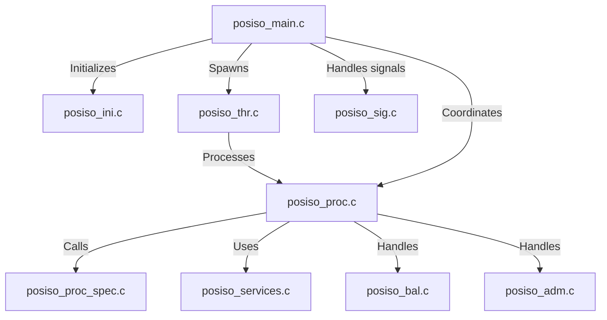
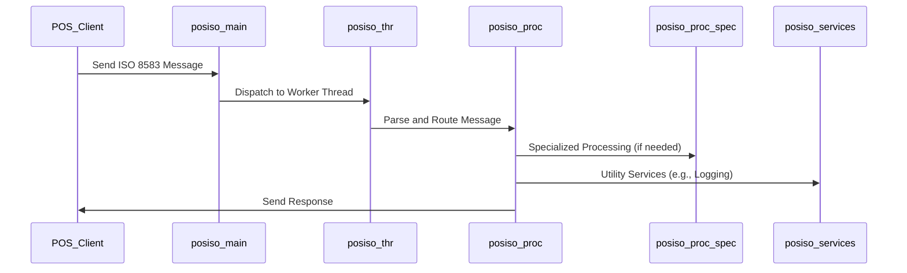
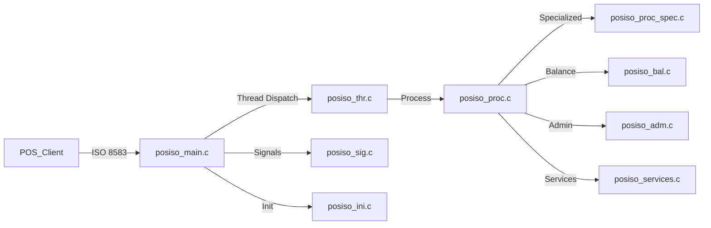

# POS Server Module Documentation

## Introduction

The POS Server module is a core component of the payment processing system, responsible for handling Point-of-Sale (POS) ISO message processing, transaction management, and communication with external payment networks. It acts as the central hub for POS transaction flows, interfacing with various card network modules (such as Visa, MasterCard, CUP, etc.), and ensuring secure, reliable, and efficient transaction processing.

## Core Functionality

The POS Server module provides the following key functionalities:
- **POS ISO Message Handling:** Receives, parses, and constructs ISO 8583 messages for POS transactions.
- **Transaction Processing:** Manages the lifecycle of POS transactions, including authorization, balance inquiry, and reversals.
- **Service Management:** Offers various POS-related services, such as administrative commands and specialized processing.
- **Thread and Signal Management:** Utilizes multi-threading and signal handling for concurrent transaction processing and robust system control.
- **Integration:** Interfaces with other modules (e.g., Visa, Base24, CBAE, etc.) for transaction routing and processing.

## Architecture Overview

The POS Server module is composed of several tightly integrated components, each responsible for a specific aspect of POS transaction processing. The main components include:

- **posiso_adm.c:** Handles administrative tasks and commands.
- **posiso_bal.c:** Manages balance inquiry transactions.
- **posiso_ini.c:** Module initialization and configuration, including signal setup.
- **posiso_main.c:** Main entry point and event loop for the POS Server.
- **posiso_proc.c:** Core transaction processing logic.
- **posiso_proc_spec.c:** Specialized transaction processing routines.
- **posiso_services.c:** Provides POS-related services and utilities.
- **posiso_sig.c:** Signal handling for process control and graceful shutdown.
- **posiso_thr.c:** Thread management for concurrent transaction processing.

### Component Relationships

## Data Flow and Process Flow

### POS Transaction Lifecycle

1. **Initialization:**
    - `posiso_ini.c` sets up configuration, signal handlers, and prepares the environment.
2. **Main Loop:**
    - `posiso_main.c` runs the main event loop, accepting incoming POS connections and messages.
3. **Thread Dispatch:**
    - `posiso_thr.c` manages worker threads for concurrent processing.
4. **Message Parsing and Routing:**
    - Incoming messages are parsed and routed to `posiso_proc.c` for processing.
5. **Transaction Processing:**
    - `posiso_proc.c` executes the core logic, invoking specialized routines in `posiso_proc_spec.c` as needed.
    - Balance inquiries are handled by `posiso_bal.c`.
    - Administrative commands are processed by `posiso_adm.c`.
6. **Service Utilities:**
    - `posiso_services.c` provides supporting services (e.g., logging, validation).
7. **Signal Handling:**
    - `posiso_sig.c` manages signals for process control (e.g., shutdown, reload).

## Integration with Other Modules

The POS Server module interacts with various network interface modules to route and process transactions according to card type and network. For example:
- **Visa Interface:** For Visa card transactions ([Visa Interface.md](Visa Interface.md))
- **Base24 Interface:** For Base24 network transactions ([Base24 Interface.md](Base24 Interface.md))
- **CBAE Interface:** For CBAE network transactions ([CBAE Interface.md](CBAE Interface.md))
- **CIS, CUP, DCISC, Discover, HSID, IST, JCB, MDS, Postilion, Pulse, SID, SMS, SMT, UAESwitch Interfaces:** For other card and network types (see respective module documentation)

The POS Server uses core data structures (e.g., accounts, balances, transaction types) defined in the [Core Data Structures.md](Core Data Structures.md) module, and relies on the [Core Libraries.md](Core Libraries.md) for communication and threading.

## Dependencies

- **Core Data Structures:** For transaction, account, and message definitions.
- **Core Libraries:** For TCP/IP communication, SSL/TLS, and threading.
- **Threading Library:** For thread and signal management.
- **TLV Library:** For TLV (Tag-Length-Value) message parsing and construction.
- **ATM Server, MQ Server, Fraud Daemon, System Monitoring Daemon:** For integration with ATM, message queuing, fraud detection, and system monitoring (see respective documentation).

## Component Interaction Diagram

## How the POS Server Fits into the Overall System

The POS Server is the central processing unit for POS transactions within the payment system. It acts as the gateway between POS terminals and the various card network interfaces, ensuring that transactions are processed according to network rules and routed to the appropriate backend systems. Its robust threading and signal management allow it to handle high transaction volumes with reliability and resilience.

For more details on related modules, refer to:
- [Visa Interface.md](Visa Interface.md)
- [Base24 Interface.md](Base24 Interface.md)
- [CBAE Interface.md](CBAE Interface.md)
- [Core Data Structures.md](Core Data Structures.md)
- [Core Libraries.md](Core Libraries.md)
- [Threading Library.md](Threading Library.md)
- [TLV Library.md](TLV Library.md)
- [ATM Server.md](ATM Server.md)
- [MQ Server.md](MQ Server.md)
- [Fraud Daemon.md](Fraud Daemon.md)
- [System Monitoring Daemon.md](System Monitoring Daemon.md)

---
*This documentation provides a high-level overview. For implementation details, refer to the source code and the documentation of referenced modules.*
