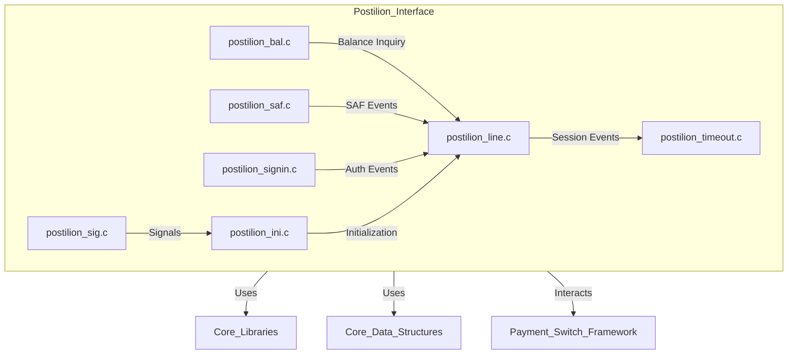
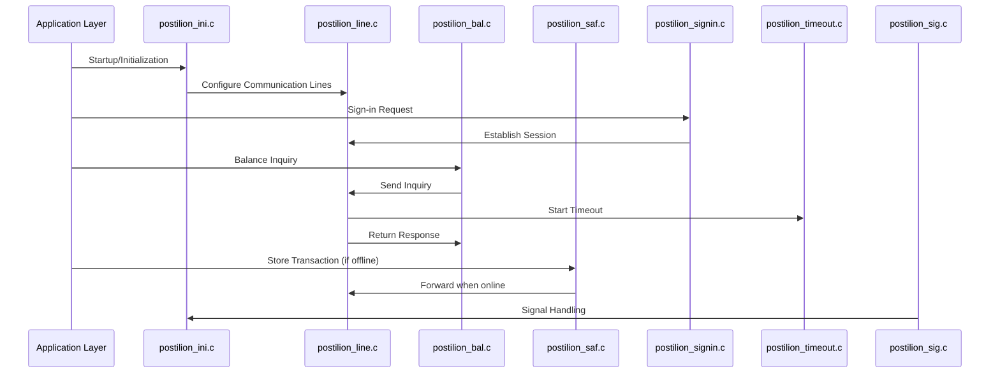
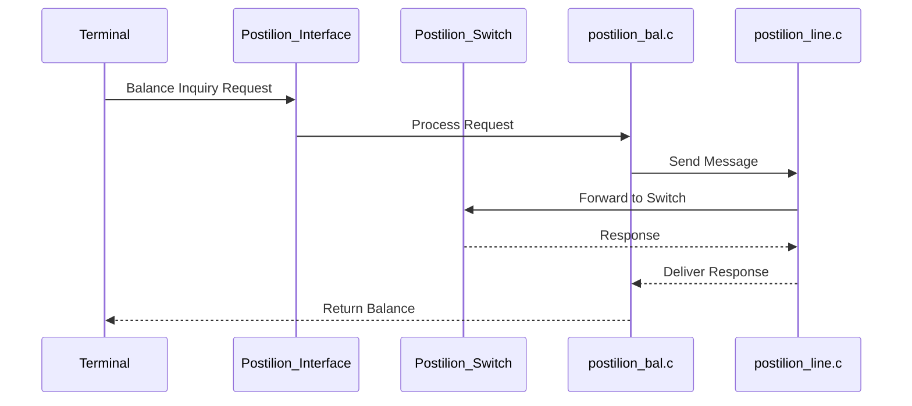

# Postilion Interface Module Documentation

## Introduction

The **Postilion Interface** module provides connectivity and transaction processing capabilities between the core system and the Postilion payment switch. It is responsible for handling message exchanges, session management, balance inquiries, safe store-and-forward (SAF) operations, and system signaling for the Postilion network. This module is a critical part of the payment switching infrastructure, ensuring reliable and secure communication with Postilion endpoints.

## Core Functionality

The Postilion Interface module is composed of several key components, each responsible for a specific aspect of the interface:

- **postilion_bal.c**: Handles balance inquiry transactions.
- **postilion_ini.c**: Manages initialization routines and signal handling (using `sigset_t`).
- **postilion_line.c**: Manages communication lines and session state.
- **postilion_saf.c**: Implements store-and-forward logic for transaction reliability.
- **postilion_sig.c**: Handles system signals and inter-process communication (using `sigset_t`).
- **postilion_signin.c**: Manages sign-in and authentication procedures.
- **postilion_timeout.c**: Handles timeout management for transactions and sessions.

These components interact with core data structures (such as `timeval` and `sigset_t`) and leverage core libraries for networking and threading.

## Architecture Overview

The Postilion Interface module follows a layered architecture, integrating with both the core system libraries and the broader payment switching framework. Below is a high-level architecture diagram:

## Component Relationships and Data Flow

### Component Interaction

### Data Flow

- **Initialization**: `postilion_ini.c` sets up signal masks and initializes communication lines.
- **Session Management**: `postilion_line.c` maintains the state of the connection and routes messages.
- **Transaction Processing**: `postilion_bal.c` and other transaction handlers send and receive messages via `postilion_line.c`.
- **SAF Handling**: `postilion_saf.c` stores transactions when the network is unavailable and forwards them when connectivity is restored.
- **Timeouts**: `postilion_timeout.c` ensures that operations do not hang indefinitely.
- **Signal Handling**: `postilion_sig.c` and `postilion_ini.c` manage system signals for graceful shutdown and error handling.

## Dependencies

The Postilion Interface module depends on several core libraries and data structures:

- **Core Data Structures**: `timeval`, `sigset_t` (see [Core Data Structures](Core Data Structures.md))
- **Core Libraries**: Networking and threading utilities (see [Core Libraries](Core Libraries.md))
- **Threading Library**: For concurrency and signal management (see [Threading Library](Threading Library.md))
- **TLV Library**: For message parsing and formatting (see [TLV Library](TLV Library.md))

## Integration with the Overall System

The Postilion Interface is one of several network interface modules (see the module tree), each responsible for a different payment network (e.g., Visa, Base24, CBAE, etc.). All interface modules share a similar structure and interact with the core system through standardized data structures and libraries. This modular approach allows for easy maintenance and extension to support additional networks.

For more details on the architecture and shared components, refer to:
- [Core Data Structures](Core Data Structures.md)
- [Core Libraries](Core Libraries.md)
- [Threading Library](Threading Library.md)
- [TLV Library](TLV Library.md)

## Process Flow Example: Balance Inquiry

## References to Related Modules

- [Visa Interface](Visa Interface.md)
- [Base24 Interface](Base24 Interface.md)
- [CBAE Interface](CBAE Interface.md)
- [Core Data Structures](Core Data Structures.md)
- [Core Libraries](Core Libraries.md)
- [Threading Library](Threading Library.md)
- [TLV Library](TLV Library.md)

---

*For further details on specific components or to understand the implementation of shared libraries and data structures, please refer to the linked documentation files above.*
