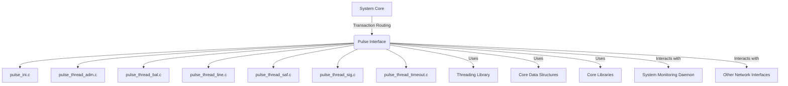
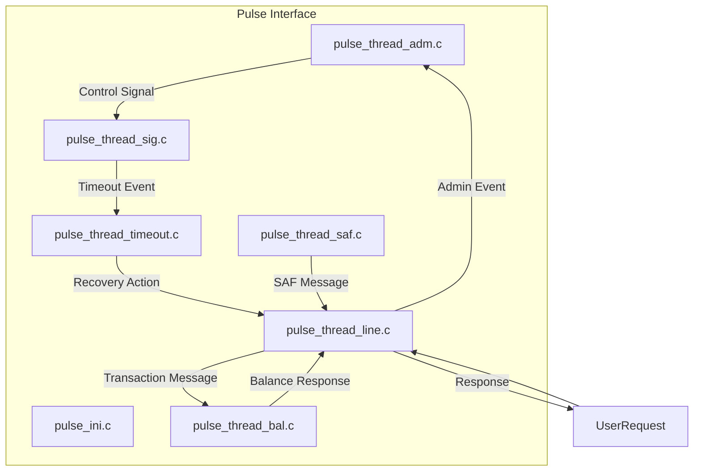
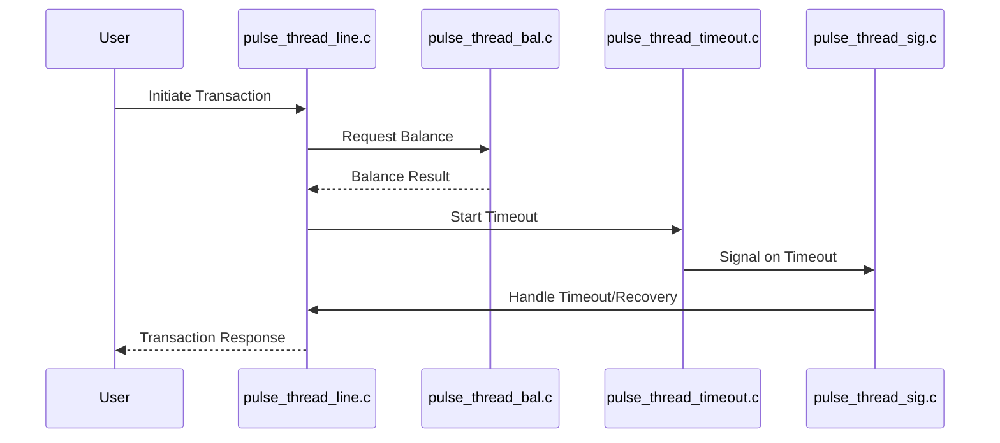

# Pulse Interface Module Documentation

## Introduction

The **Pulse Interface** module is a key component in a multi-network payment switching system. It provides connectivity, transaction processing, and message handling for the Pulse network, integrating with the system's core transaction and threading infrastructure. The module is designed to operate in parallel with other network interfaces (such as Visa, Base24, CBAE, etc.), ensuring seamless transaction routing, authorization, and settlement across multiple payment networks.

## Core Functionality

The Pulse Interface module is responsible for:
- Initializing Pulse network connections and configuration (`pulse_ini.c`)
- Managing administrative, balance inquiry, line management, and SAF (Store and Forward) threads
- Handling network signals and timeouts for robust, fault-tolerant operation
- Interfacing with the system's threading and alarm libraries for concurrency and reliability

## Architecture Overview

The Pulse Interface follows a modular, thread-based architecture. Each major function (administration, balance, line, SAF, timeout, and signal handling) is implemented as a separate thread or handler, coordinated via shared data structures and system libraries.

### Component Breakdown
- **pulse_ini.c**: Initialization routines, configuration loading, signal set management
- **pulse_thread_adm.c**: Administrative thread for network management and control
- **pulse_thread_bal.c**: Balance inquiry processing thread
- **pulse_thread_line.c**: Line management and communication thread
- **pulse_thread_saf.c**: Store and Forward (SAF) processing thread
- **pulse_thread_sig.c**: Signal handling for inter-thread and system events
- **pulse_thread_timeout.c**: Timeout and watchdog thread for fault detection

### Dependencies
- **Threading Library**: Provides core threading, signal, and timeout primitives (see [Threading Library](Threading Library.md))
- **Core Data Structures**: Shared types for accounts, balances, and network messages (see [Core Data Structures](Core Data Structures.md))
- **Core Libraries**: TCP/IP and SSL communication primitives (see [Core Libraries](Core Libraries.md))

## System Integration

The Pulse Interface is one of several network modules in the system. It interacts with the central transaction switch, shares threading and alarm resources, and follows common patterns for message parsing, error handling, and recovery. The module is designed for high availability and can be monitored and controlled via system management daemons.

## Architecture Diagram

## Data Flow Diagram

## Component Interaction

- **Initialization**: `pulse_ini.c` sets up configuration, signal masks, and launches threads.
- **Thread Coordination**: Threads communicate via shared memory, signals, and event queues provided by the Threading Library.
- **Timeouts and Recovery**: `pulse_thread_timeout.c` monitors thread health and triggers recovery via signals handled in `pulse_thread_sig.c`.
- **SAF Handling**: `pulse_thread_saf.c` manages queued transactions for later processing if the network is unavailable.

## Process Flow Example

## Relationships to Other Modules

- **Threading Library**: All Pulse threads use the system's threading and alarm primitives. See [Threading Library](Threading Library.md) for details.
- **Core Data Structures**: Message and account types are shared across all network interfaces. See [Core Data Structures](Core Data Structures.md).
- **Core Libraries**: TCP/IP and SSL communication is abstracted via the Core Libraries. See [Core Libraries](Core Libraries.md).
- **System Monitoring Daemon**: For health checks and administrative control. See [System Monitoring Daemon](System Monitoring Daemon.md).
- **Other Network Interfaces**: Follows the same architectural pattern as Visa, Base24, etc. See their respective documentation for network-specific details.

## References
- [Threading Library](Threading Library.md)
- [Core Data Structures](Core Data Structures.md)
- [Core Libraries](Core Libraries.md)
- [System Monitoring Daemon](System Monitoring Daemon.md)
- [Visa Interface](Visa Interface.md)
- [Base24 Interface](Base24 Interface.md)
- [CBAE Interface](CBAE Interface.md)
- [CIS Interface](CIS Interface.md)
- [CUP Interface](CUP Interface.md)
- [DCISC Interface](DCISC Interface.md)
- [Discover Interface](Discover Interface.md)
- [HSID Interface](HSID Interface.md)
- [IST Interface](IST Interface.md)
- [JCB Interface](JCB Interface.md)
- [MDS Interface](MDS Interface.md)
- [Postilion Interface](Postilion Interface.md)
- [SID Interface](SID Interface.md)
- [SMS Interface](SMS Interface.md)
- [SMT Interface](SMT Interface.md)
- [UAESwitch Interface](UAESwitch Interface.md)
