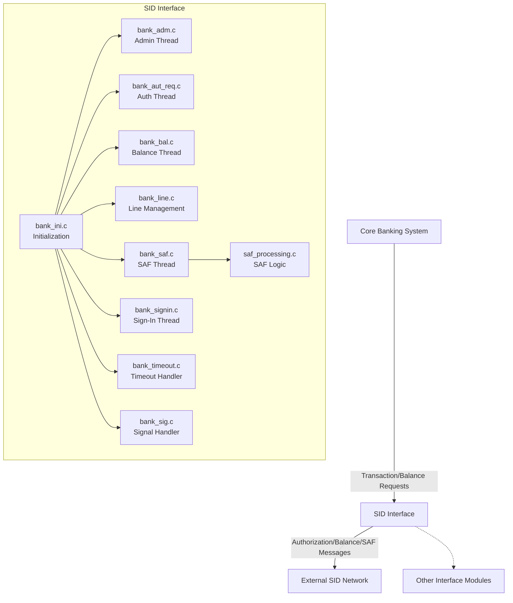
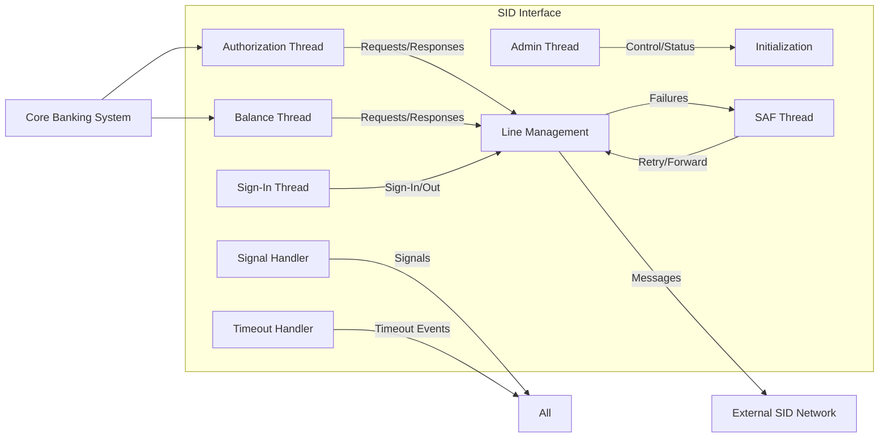
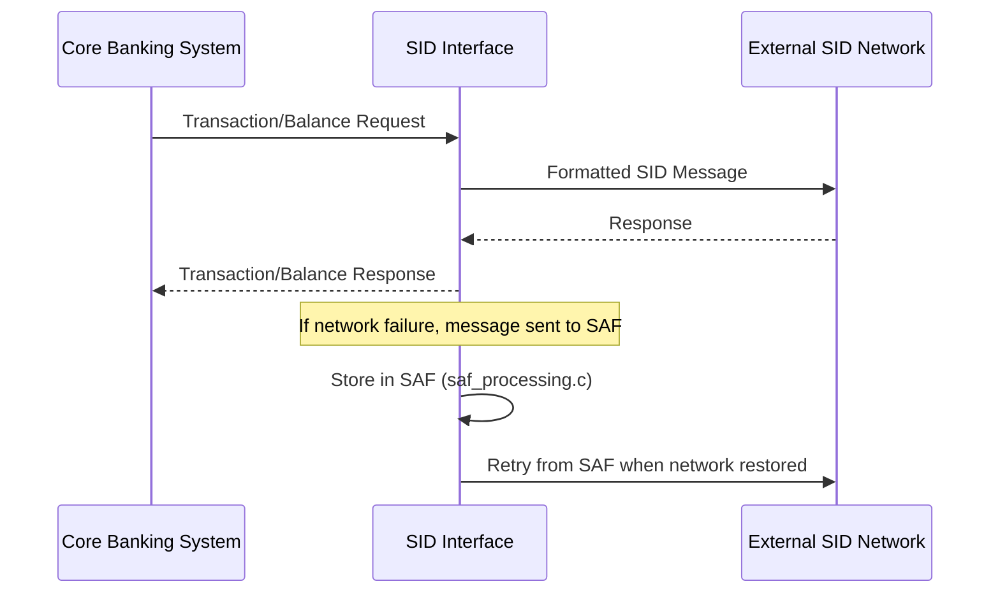

# SID Interface Module Documentation

## Introduction

The **SID Interface** module is responsible for facilitating communication and transaction processing between the core banking system and external networks or services that use the SID protocol. It acts as a bridge, handling message translation, session management, transaction authorization, balance inquiries, and secure file transfers. The SID Interface is designed to ensure reliable, secure, and efficient processing of financial messages in a multi-threaded environment.

## Core Functionality

The SID Interface module provides the following key functionalities:

- **Session Initialization and Management**: Handles the setup and maintenance of communication sessions with external SID endpoints.
- **Authorization Requests**: Processes incoming and outgoing authorization requests for financial transactions.
- **Balance Inquiries**: Manages requests and responses for account balance checks.
- **File and SAF (Store and Forward) Processing**: Ensures reliable message delivery, even in the event of network failures, by storing and forwarding messages as needed.
- **Timeout and Signal Handling**: Manages timeouts and system signals to ensure robust operation and graceful error handling.
- **Threaded Processing**: Utilizes multiple threads to handle different types of messages and operations concurrently, improving throughput and responsiveness.

## Core Components

The SID Interface consists of the following main source files and their primary responsibilities:

| Source File         | Main Responsibilities                                  |
|---------------------|-------------------------------------------------------|
| `bank_adm.c`        | Administration thread: handles configuration, status, and control messages. |
| `bank_aut_req.c`    | Processes authorization requests and responses.        |
| `bank_bal.c`        | Handles balance inquiry requests and responses.        |
| `bank_ini.c`        | Module initialization, configuration loading, and signal setup. |
| `bank_line.c`       | Manages communication lines and session state.         |
| `bank_saf.c`        | Store and Forward (SAF) message processing.            |
| `bank_sig.c`        | Signal handling for process control and error recovery.|
| `bank_signin.c`     | Manages sign-in/sign-out procedures with external networks. |
| `bank_timeout.c`    | Handles operation timeouts and retry logic.            |
| `saf_processing.c`  | Core SAF logic for message persistence and recovery.   |

## Architecture Overview

The SID Interface module is structured as a set of cooperating threads, each responsible for a specific aspect of message processing. These threads communicate via shared memory, message queues, or inter-thread signaling. The module interacts with the core banking system and external networks using standardized message formats and protocols.

### High-Level Architecture Diagram

## Component Relationships and Data Flow

### Thread and Process Flow

- **Initialization (`bank_ini.c`)**: Sets up configuration, signal masks, and spawns worker threads.
- **Admin Thread (`bank_adm.c`)**: Receives administrative commands, updates configuration, and reports status.
- **Authorization Thread (`bank_aut_req.c`)**: Handles transaction authorization requests from the core system, communicates with the external SID network, and returns responses.
- **Balance Thread (`bank_bal.c`)**: Processes balance inquiries in a similar fashion.
- **Line Management (`bank_line.c`)**: Maintains the state of network connections, handles reconnections, and monitors line health.
- **SAF Thread (`bank_saf.c` & `saf_processing.c`)**: Ensures messages are stored and forwarded reliably in case of network issues.
- **Sign-In Thread (`bank_signin.c`)**: Manages periodic sign-in/sign-out procedures required by the SID protocol.
- **Timeout Handler (`bank_timeout.c`)**: Monitors operation timeouts and triggers retries or error handling as needed.
- **Signal Handler (`bank_sig.c`)**: Responds to system signals for graceful shutdown, reload, or error recovery.

### Data Flow Diagram

## Dependencies and Integration

The SID Interface module depends on several core libraries and data structures for networking, threading, and message formatting. Key dependencies include:

- **Core Data Structures**: For account, bank, and message representations (see [Core Data Structures](Core Data Structures.md)).
- **Core Libraries**: For TCP/IP and SSL/TLS communication (see [Core Libraries](Core Libraries.md)).
- **Threading Library**: For thread management and synchronization (see [Threading Library](Threading Library.md)).
- **TLV Library**: For Tag-Length-Value message parsing and formatting (see [TLV Library](TLV Library.md)).

The SID Interface also interacts with other interface modules (e.g., Visa, Base24, CBAE) for cross-network transaction routing and shared infrastructure. For details on these modules, refer to their respective documentation files:

- [Visa Interface](Visa Interface.md)
- [Base24 Interface](Base24 Interface.md)
- [CBAE Interface](CBAE Interface.md)
- [HSID Interface](HSID Interface.md)

## Component Interaction Diagram

## Process Flows

### Example: Authorization Request Handling

1. **Core Banking System** sends an authorization request to the SID Interface.
2. **SID Interface** (bank_aut_req.c) receives the request and formats it according to the SID protocol.
3. The request is sent via **bank_line.c** to the external SID network.
4. If the network is unavailable, the request is stored using **saf_processing.c**.
5. Upon receiving a response, the SID Interface forwards it back to the core system.

### Example: SAF Message Recovery

1. **SAF Thread** detects network restoration.
2. Messages stored in SAF are retrieved and resent via **bank_line.c**.
3. Successful deliveries are acknowledged and removed from SAF storage.

## How SID Interface Fits Into the Overall System

The SID Interface is one of several network interface modules that connect the core banking system to external payment networks. It shares architectural patterns and dependencies with other modules (such as Visa, Base24, and CBAE), enabling consistent transaction processing, monitoring, and error handling across all supported protocols. The modular design allows for easy maintenance, scalability, and integration with new networks as needed.

For more details on shared infrastructure and cross-module interactions, see the documentation for [Core Data Structures](Core Data Structures.md), [Core Libraries](Core Libraries.md), and [Threading Library](Threading Library.md).

---

*For further details on specific components or integration points, refer to the documentation files of the referenced modules above.*
