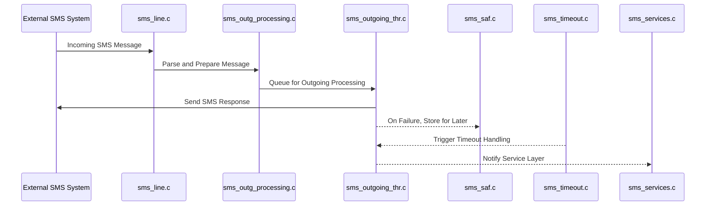
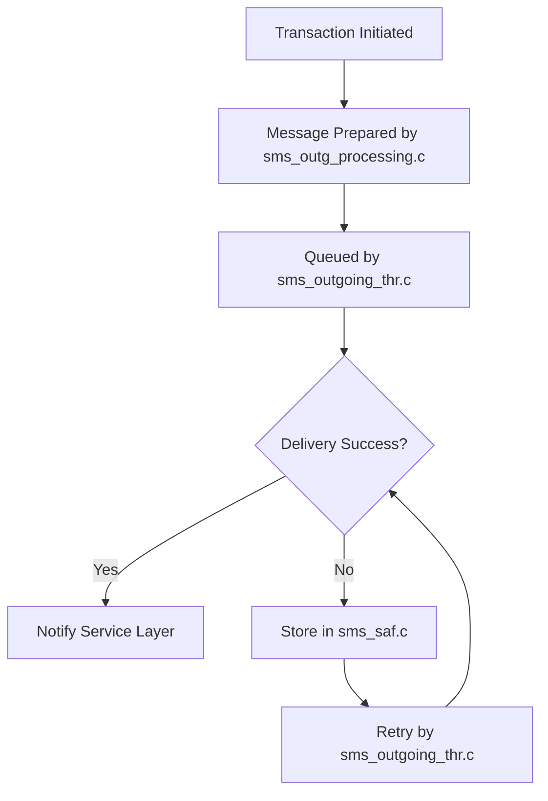

# SMS Interface Module Documentation

## Introduction

The **SMS Interface** module is responsible for handling the integration and processing of SMS-based financial transactions within the overall payment switching system. It manages the lifecycle of SMS messages related to transaction authorization, balance inquiries, file updates, network management, and more. The module ensures reliable communication with external SMS-based systems, supports safe transaction processing, and provides mechanisms for message queuing, reversal, and timeout handling.

## Core Functionality

The SMS Interface module provides the following key functionalities:

- **Administration**: Handles administrative commands and configuration updates (`sms_adm.c`).
- **Advice Processing**: Manages advice messages, typically for transaction status updates (`sms_advice.c`).
- **Authorization Requests**: Processes incoming and outgoing authorization requests (`sms_aut_req.c`).
- **Balance Inquiry**: Handles balance inquiry transactions (`sms_bal.c`).
- **File Updates**: Manages updates to files required for SMS transaction processing (`sms_file_upd.c`).
- **Initialization**: Sets up the SMS interface, including signal handling (`sms_ini.c`).
- **Line Management**: Manages communication lines for SMS message exchange (`sms_line.c`).
- **Network Management**: Handles network-level events and status (`sms_net_mng.c`).
- **Outgoing Processing**: Processes outgoing SMS messages and manages their delivery (`sms_outg_processing.c`, `sms_outgoing_thr.c`).
- **Reversal Processing**: Handles transaction reversals (`sms_reversal.c`).
- **Store and Forward (SAF)**: Ensures reliable message delivery by storing messages for later forwarding if immediate delivery fails (`sms_saf.c`).
- **Service Management**: Provides various SMS-related services (`sms_services.c`).
- **Signal Handling**: Manages system signals for safe operation (`sms_sig.c`).
- **Timeout Handling**: Manages transaction and message timeouts (`sms_timeout.c`).

## Architecture Overview

The SMS Interface module is composed of several tightly integrated components, each responsible for a specific aspect of SMS transaction processing. The architecture is designed to support high reliability, concurrency, and seamless integration with the broader payment switching system.

### Component Relationships

```mermaid
graph TD
    subgraph SMS Interface
        ADM[sms_adm.c\n(Admin)]
        ADV[sms_advice.c\n(Advice)]
        AUT[sms_aut_req.c\n(Auth Request)]
        BAL[sms_bal.c\n(Balance)]
        FUP[sms_file_upd.c\n(File Update)]
        INI[sms_ini.c\n(Init)]
        LINE[sms_line.c\n(Line)]
        NET[sms_net_mng.c\n(Net Mgmt)]
        OUTP[sms_outg_processing.c\n(Outgoing Proc)]
        OUTT[sms_outgoing_thr.c\n(Outgoing Thr)]
        REV[sms_reversal.c\n(Reversal)]
        SAF[sms_saf.c\n(SAF)]
        SRV[sms_services.c\n(Services)]
        SIG[sms_sig.c\n(Signal)]
        TMO[sms_timeout.c\n(Timeout)]
    end
    INI --> ADM
    INI --> ADV
    INI --> AUT
    INI --> BAL
    INI --> FUP
    INI --> LINE
    INI --> NET
    INI --> OUTP
    INI --> OUTT
    INI --> REV
    INI --> SAF
    INI --> SRV
    INI --> SIG
    INI --> TMO
    SAF --> OUTT
    OUTP --> OUTT
    LINE --> OUTP
    LINE --> OUTT
    NET --> LINE
    TMO --> OUTT
    TMO --> SAF
    SIG --> TMO
```

### Data Flow and Process Overview



## Integration with the Overall System

The SMS Interface module is one of several channel interface modules (see also [Visa Interface](Visa%20Interface.md), [Base24 Interface](Base24%20Interface.md), [CBAE Interface](CBAE%20Interface.md), etc.) that connect the core switching logic to external networks and systems. It interacts with:

- **Core Data Structures**: Utilizes shared data types for accounts, balances, and transaction metadata (see [Core Data Structures](Core%20Data%20Structures.md)).
- **Core Libraries**: Leverages TCP/IP and SSL/TLS communication libraries for network operations (see [Core Libraries](Core%20Libraries.md)).
- **Threading Library**: Employs threading and signal management utilities for concurrency and safe operation (see [Threading Library](Threading%20Library.md)).
- **Other Channel Interfaces**: Follows similar architectural patterns as other interfaces, enabling consistent transaction processing across channels.

## Component Interaction and Dependencies

- **Initialization (`sms_ini.c`)**: Sets up signal handlers, configuration, and spawns necessary threads for each functional area.
- **Signal Handling (`sms_sig.c`)**: Ensures safe shutdown, reload, and error handling across all SMS Interface threads.
- **Timeout Management (`sms_timeout.c`)**: Monitors transaction and message timeouts, triggering retries or reversals as needed.
- **Store and Forward (`sms_saf.c`)**: Buffers undelivered messages and coordinates with outgoing threads for reliable delivery.
- **Outgoing Processing (`sms_outg_processing.c`, `sms_outgoing_thr.c`)**: Manages the queueing, formatting, and sending of outgoing SMS messages, interfacing with network management and SAF components.

## Process Flow Example: Outgoing SMS Transaction



## References

- [Visa Interface](Visa%20Interface.md)
- [Base24 Interface](Base24%20Interface.md)
- [CBAE Interface](CBAE%20Interface.md)
- [Core Data Structures](Core%20Data%20Structures.md)
- [Core Libraries](Core%20Libraries.md)
- [Threading Library](Threading%20Library.md)

---

*For details on shared data structures, threading, and network communication, refer to the respective module documentation linked above.*
