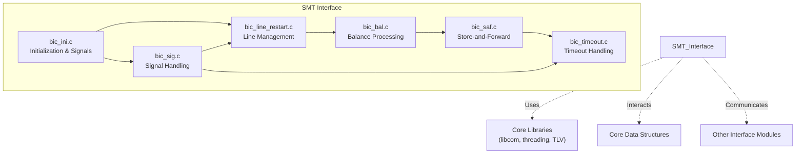
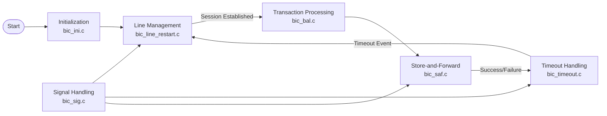
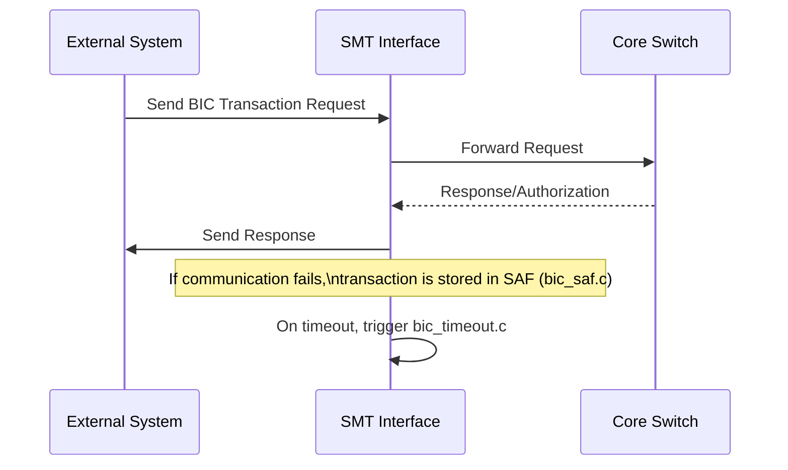

# SMT Interface Module Documentation

## Introduction

The **SMT Interface** module provides connectivity and transaction processing for the BIC (Bank Interface Controller) protocol within the payment switching system. It is responsible for handling BIC-specific transaction flows, session management, and communication with external banking systems using the BIC protocol. The module ensures reliable message exchange, session integrity, and supports safe transaction processing (SAF), timeouts, and line management for the BIC channel.

## Core Functionality

The SMT Interface module consists of the following core components:

- **bic_bal.c**: Handles balance inquiries and related transaction flows for BIC.
- **bic_ini.c**: Manages initialization routines and signal handling for the BIC interface.
- **bic_line_restart.c**: Responsible for line management and restart logic for BIC communication channels.
- **bic_saf.c**: Implements Store-and-Forward (SAF) logic for BIC transactions, ensuring message delivery in case of temporary outages.
- **bic_sig.c**: Handles signal processing and inter-process communication for the BIC interface.
- **bic_timeout.c**: Manages timeout events and recovery mechanisms for BIC sessions.

## Architecture Overview

The SMT Interface is designed as a modular, thread-based system that interacts with the core switching engine and other interface modules (such as Visa, Base24, CBAE, etc.). It leverages shared libraries for networking, threading, and TLV (Tag-Length-Value) message parsing. The module is structured to ensure high reliability and maintainability, with clear separation of concerns between transaction processing, session management, and error handling.

### High-Level Architecture

## Component Relationships and Data Flow

### Component Interaction

- **Initialization**: `bic_ini.c` sets up signal masks, initializes resources, and spawns necessary threads for BIC processing.
- **Line Management**: `bic_line_restart.c` manages the state of communication lines, handling restarts and recovery.
- **Transaction Processing**: `bic_bal.c` processes balance inquiries and related transactions, interacting with line and SAF components.
- **Store-and-Forward**: `bic_saf.c` ensures that transactions are safely stored and forwarded in case of communication failures.
- **Signal Handling**: `bic_sig.c` processes system and application signals, coordinating with other components for orderly shutdown or recovery.
- **Timeout Handling**: `bic_timeout.c` monitors and handles timeout events, triggering retries or error handling as needed.

### Data Flow Diagram

## Dependencies

The SMT Interface module depends on several shared libraries and core data structures:

- **Core Libraries**: Networking (`libcom/tcp_com.c`, `libcom/tcp_ssl.c`), threading (`alarm_thr.c`, `thr_utils.c`), and TLV parsing (`dump_tlv.c`).
- **Core Data Structures**: Common types such as `timeval`, `sigset_t`, and banking/account structures.
- **Other Interface Modules**: For cross-channel transaction routing and system-wide coordination. See [Visa Interface](Visa Interface.md), [Base24 Interface](Base24 Interface.md), [CBAE Interface](CBAE Interface.md), etc.

## Process Flows

### Example: BIC Transaction Processing

## Integration in the Overall System

The SMT Interface is one of several protocol-specific modules in the payment switch. It operates alongside other interfaces (Visa, Base24, CBAE, etc.), each handling their respective protocols. The SMT Interface communicates with the core switch for transaction routing and with external banking systems for BIC protocol operations. It shares common infrastructure for networking, threading, and message parsing with other modules.

For details on shared libraries and data structures, refer to:
- [Core Libraries](Core Libraries.md)
- [Core Data Structures](Core Data Structures.md)

For information on other protocol interfaces, see:
- [Visa Interface](Visa Interface.md)
- [Base24 Interface](Base24 Interface.md)
- [CBAE Interface](CBAE Interface.md)

## Summary

The SMT Interface module is a robust, protocol-specific component that ensures reliable BIC transaction processing within the payment switch. Its modular design, reliance on shared infrastructure, and integration with other interface modules make it a critical part of the overall system architecture.
