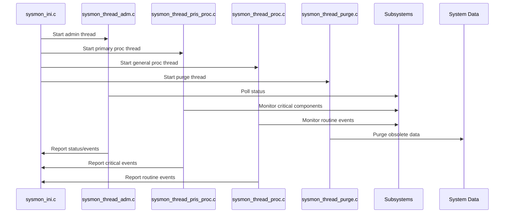
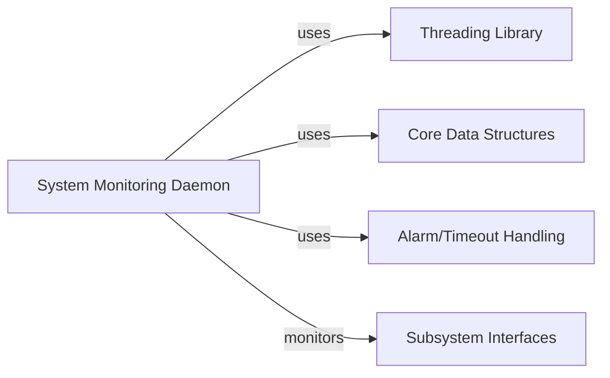

# System Monitoring Daemon

## Introduction

The **System Monitoring Daemon** is a core module responsible for monitoring, supervising, and maintaining the health and operational status of the overall transaction processing system. It provides real-time supervision, periodic checks, and automated purging of obsolete or unnecessary data, ensuring system reliability and performance. The daemon interacts with various subsystems and interfaces, collecting status, triggering alarms, and performing administrative and maintenance tasks.

## Core Functionality

- **Initialization**: Sets up signal handling and prepares the monitoring environment (`sysmon_ini.c`).
- **Administrative Thread**: Handles administrative monitoring tasks, such as status polling and event logging (`sysmon_thread_adm.c`).
- **Primary Processing Thread**: Performs high-priority monitoring and processing, ensuring critical system components are functioning (`sysmon_thread_pris_proc.c`).
- **General Processing Thread**: Conducts routine monitoring and processing of system events (`sysmon_thread_proc.c`).
- **Purge Thread**: Periodically purges obsolete or expired data to maintain system hygiene (`sysmon_thread_purge.c`).

## Architecture Overview

```mermaid
graph TD
    A[System Monitoring Daemon]
    A --> B[Initialization (sysmon_ini.c)]
    A --> C[Admin Thread (sysmon_thread_adm.c)]
    A --> D[Primary Proc Thread (sysmon_thread_pris_proc.c)]
    A --> E[General Proc Thread (sysmon_thread_proc.c)]
    A --> F[Purge Thread (sysmon_thread_purge.c)]
    B -->|Signal Handling| G[Thread Management]
    C -->|Status Polling| H[Subsystems]
    D -->|Critical Monitoring| H
    E -->|Routine Monitoring| H
    F -->|Data Purge| I[System Data]
```

## Component Relationships

- **sysmon_ini.c**: Handles signal setup (`sigset_t`) and initializes the daemon environment. Prepares the system for multi-threaded operation.
- **sysmon_thread_adm.c**: Uses `timeval` for scheduling periodic administrative checks and logging.
- **sysmon_thread_pris_proc.c**: Uses `timeval` for high-priority, time-sensitive monitoring tasks.
- **sysmon_thread_proc.c**: Uses `timeval` for general monitoring and event processing.
- **sysmon_thread_purge.c**: Uses `timeval` to schedule and execute data purging routines.

## Data Flow and Process Flow



## Dependencies and Integration

The System Monitoring Daemon interacts with multiple subsystems and interfaces, including:
- **Threading Library** ([Threading Library.md]): For thread management, signal handling, and timing utilities.
- **Core Data Structures** ([Core Data Structures.md]): For shared data types and structures.
- **Alarm and Timeout Handling** ([alarm_thr.h] in [Core Data Structures.md]): For alarm signaling and timeout management.
- **Subsystem Interfaces** (e.g., [Visa Interface.md], [Base24 Interface.md], [CBAE Interface.md]): For monitoring the health and status of transaction interfaces.

## Component Interaction Diagram



## How It Fits Into the Overall System

The System Monitoring Daemon acts as the central watchdog and maintenance agent for the transaction processing system. It ensures that all subsystems are operational, detects and reports anomalies, and performs automated maintenance. Its threads are tightly integrated with the threading and alarm libraries, and it communicates with all major subsystem interfaces to provide a unified monitoring and control layer.

For details on subsystem interfaces and threading mechanisms, refer to:
- [Threading Library.md]
- [Core Data Structures.md]
- [Visa Interface.md], [Base24 Interface.md], [CBAE Interface.md], etc.
