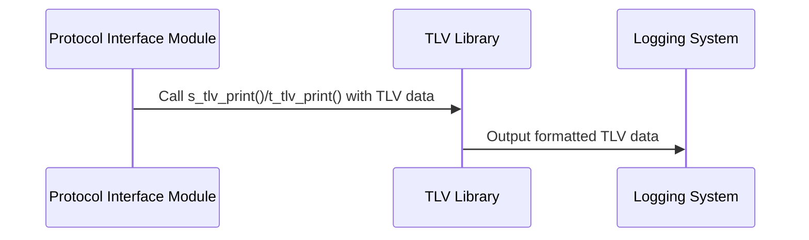

# TLV Library Documentation

## Introduction

The TLV (Tag-Length-Value) Library provides core utilities for handling, printing, and debugging TLV-encoded data structures within the payment switching and transaction processing system. TLV encoding is widely used in financial messaging standards (such as ISO 8583 and EMV) to represent structured data in a flexible and extensible way. The TLV Library is essential for interpreting, displaying, and troubleshooting message contents across various interfaces and protocols in the system.

## Core Functionality

The TLV Library consists primarily of two components:

- **dump_tlv.c**: Implements functions for printing and formatting TLV structures, including `s_tlv_print` and `t_tlv_print`. These functions are used for debugging and logging TLV data.
- **dump_tlv_prod.c**: Provides production-grade TLV printing utilities, reusing or extending the core print functions.

These utilities are used throughout the system for:
- Logging incoming and outgoing messages in a human-readable format
- Debugging protocol implementations
- Verifying message integrity and structure

## Architecture and Component Relationships

The TLV Library is a utility module that is invoked by many protocol interface modules (e.g., Visa, Base24, CBAE, etc.) and core data structure handlers. It does not maintain state or manage threads; instead, it provides stateless functions for use by other modules.

### High-Level Architecture

```mermaid
graph TD
    subgraph TLV_Library
        DUMP_TLV[dump_tlv.c\ns_tlv_print, t_tlv_print]
        DUMP_TLV_PROD[dump_tlv_prod.c\nt_tlv_print, s_tlv_print]
    end
    subgraph Protocol_Interfaces
        VISA[Visa Interface]
        BASE24[Base24 Interface]
        CBAE[CBAE Interface]
        CIS[CIS Interface]
        CUP[CUP Interface]
        DCISC[DCISC Interface]
        DISCOVER[Discover Interface]
        HSID[HSID Interface]
        IST[IST Interface]
        JCB[JCB Interface]
        MDS[MDS Interface]
        POSTILION[Postilion Interface]
        PULSE[Pulse Interface]
        SID[SID Interface]
        SMS[SMS Interface]
        SMT[SMT Interface]
        UAESWITCH[UAESwitch Interface]
    end
    subgraph Core_Data_Structures
        BASE24_H[base24.h\ntlv_info_type, tlv_info_st, ...]
    end
    DUMP_TLV -->|"Prints/Debugs TLV data"| VISA
    DUMP_TLV --> BASE24
    DUMP_TLV --> CBAE
    DUMP_TLV --> CIS
    DUMP_TLV --> CUP
    DUMP_TLV --> DCISC
    DUMP_TLV --> DISCOVER
    DUMP_TLV --> HSID
    DUMP_TLV --> IST
    DUMP_TLV --> JCB
    DUMP_TLV --> MDS
    DUMP_TLV --> POSTILION
    DUMP_TLV --> PULSE
    DUMP_TLV --> SID
    DUMP_TLV --> SMS
    DUMP_TLV --> SMT
    DUMP_TLV --> UAESWITCH
    DUMP_TLV -->|"Prints/Debugs TLV structures"| BASE24_H
    DUMP_TLV_PROD --> DUMP_TLV
```

### Component Interaction

- **Protocol Interface Modules** (e.g., Visa, Base24, CBAE, etc.) parse and construct TLV-encoded messages as part of their transaction processing. When logging or debugging is required, these modules call the TLV Library's print functions to output the TLV data in a readable format.
- **Core Data Structures** (such as those defined in `base24.h`) define the TLV data types and structures that the TLV Library operates on.

### Data Flow

## Dependencies

- **Input:** TLV-encoded data structures, typically defined in [Core Data Structures](Core Data Structures.md) (e.g., `tlv_info_type`, `tlv_info_st` from `base24.h`).
- **Output:** Human-readable representations of TLV data, sent to logs or debug consoles.
- **Consumers:** All protocol interface modules and any component that needs to inspect or debug TLV data.

## Integration in the Overall System

The TLV Library is a foundational utility that supports all protocol interfaces and core transaction processing modules. It is not directly involved in message parsing or business logic, but it is critical for observability, troubleshooting, and compliance verification.

For details on how TLV data structures are defined and used, see [Core Data Structures.md]. For information on how protocol modules use TLV encoding, refer to the respective module documentation (e.g., [Visa Interface.md], [Base24 Interface.md], etc.).

## References
- [Core Data Structures.md]
- [Visa Interface.md]
- [Base24 Interface.md]
- [CBAE Interface.md]
- [CIS Interface.md]
- [CUP Interface.md]
- [DCISC Interface.md]
- [Discover Interface.md]
- [HSID Interface.md]
- [IST Interface.md]
- [JCB Interface.md]
- [MDS Interface.md]
- [Postilion Interface.md]
- [Pulse Interface.md]
- [SID Interface.md]
- [SMS Interface.md]
- [SMT Interface.md]
- [UAESwitch Interface.md]
