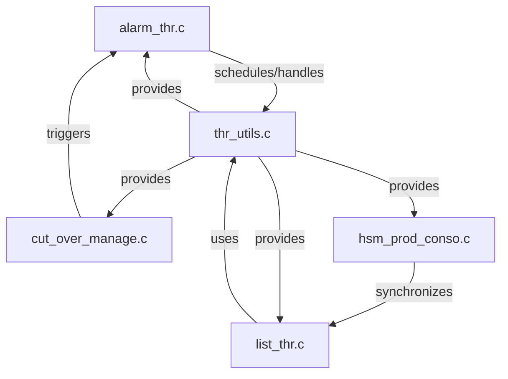
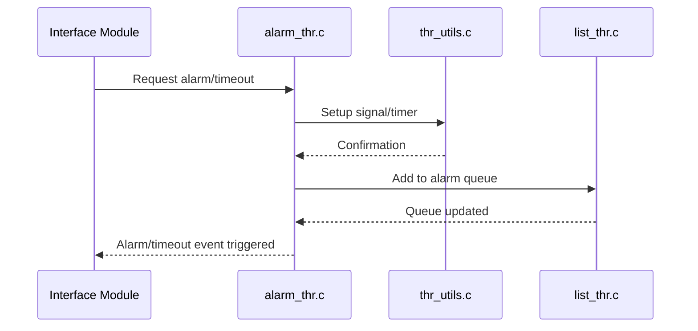
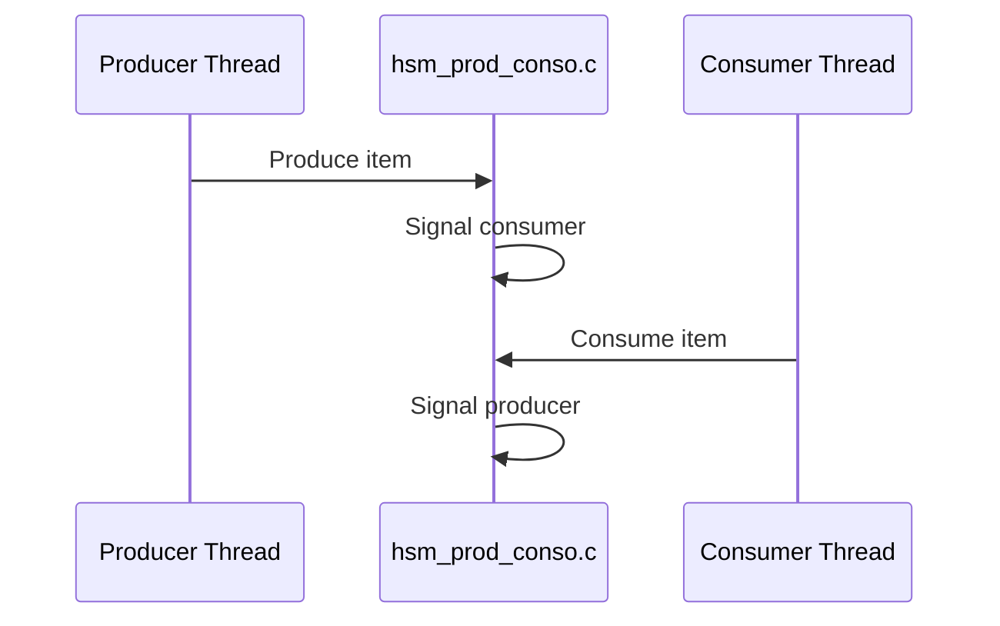

# Threading Library

## Introduction

The **Threading Library** provides core threading, synchronization, and timing utilities for the entire system. It abstracts and manages thread creation, inter-thread communication, signal handling, and time-based operations, ensuring robust and efficient concurrent processing across all modules. This library is foundational for modules that require multi-threaded execution, timeouts, alarms, and producer-consumer patterns.

## Core Functionality

The Threading Library offers:
- Thread management and utilities
- Signal handling for thread-safe operations
- Time-based event scheduling (alarms, timeouts)
- Producer-consumer synchronization primitives
- List management for thread-safe queues

### Main Components
- **alarm_thr.c**: Implements alarm and timeout mechanisms using `timeval`, `sigset_t`, and `timespec`.
- **cut_over_manage.c**: Handles cut-over operations with time-based triggers (`tm`, `timespec`, `timeval`).
- **hsm_prod_conso.c**: Provides producer-consumer synchronization using `timeval` and `timespec`.
- **list_thr.c**: Manages thread-safe lists and queues (`timeval`).
- **thr_utils.c**: Utility functions for thread and signal management (`sigset_t`, `timeval`, `timespec`).

## Architecture Overview

The Threading Library sits at the core of the system, providing services to all interface modules (e.g., Visa, Base24, CBAE, etc.), servers (ATM, POS, MQ), and daemons (Fraud, System Monitoring). It interacts closely with the **Core Data Structures** and **Core Libraries** for data representation and network communication.

### High-Level Architecture

```mermaid
graph TD
    subgraph Threading_Library
        alarm_thr["alarm_thr.c"]
        cut_over_manage["cut_over_manage.c"]
        hsm_prod_conso["hsm_prod_conso.c"]
        list_thr["list_thr.c"]
        thr_utils["thr_utils.c"]
    end
    CoreData["Core Data Structures"]
    CoreLibs["Core Libraries"]
    Visa["Visa Interface"]
    Base24["Base24 Interface"]
    CBAE["CBAE Interface"]
    CIS["CIS Interface"]
    CUP["CUP Interface"]
    DCISC["DCISC Interface"]
    Discover["Discover Interface"]
    HSID["HSID Interface"]
    IST["IST Interface"]
    JCB["JCB Interface"]
    MDS["MDS Interface"]
    Postilion["Postilion Interface"]
    Pulse["Pulse Interface"]
    SID["SID Interface"]
    SMS["SMS Interface"]
    SMT["SMT Interface"]
    UAESwitch["UAESwitch Interface"]
    ATM["ATM Server"]
    POS["POS Server"]
    MQ["MQ Server"]
    Fraud["Fraud Daemon"]
    SysMon["System Monitoring Daemon"]

    alarm_thr --> CoreData
    cut_over_manage --> CoreData
    hsm_prod_conso --> CoreData
    list_thr --> CoreData
    thr_utils --> CoreData
    alarm_thr --> CoreLibs
    cut_over_manage --> CoreLibs
    hsm_prod_conso --> CoreLibs
    list_thr --> CoreLibs
    thr_utils --> CoreLibs

    Visa --> Threading_Library
    Base24 --> Threading_Library
    CBAE --> Threading_Library
    CIS --> Threading_Library
    CUP --> Threading_Library
    DCISC --> Threading_Library
    Discover --> Threading_Library
    HSID --> Threading_Library
    IST --> Threading_Library
    JCB --> Threading_Library
    MDS --> Threading_Library
    Postilion --> Threading_Library
    Pulse --> Threading_Library
    SID --> Threading_Library
    SMS --> Threading_Library
    SMT --> Threading_Library
    UAESwitch --> Threading_Library
    ATM --> Threading_Library
    POS --> Threading_Library
    MQ --> Threading_Library
    Fraud --> Threading_Library
    SysMon --> Threading_Library
```

## Component Relationships and Data Flow

### Component Interaction

### Data Flow Example: Alarm and Timeout Handling

## Integration with Other Modules

The Threading Library is a foundational dependency for all modules requiring concurrency, timeouts, or signal handling. For details on how specific modules utilize threading features, refer to their respective documentation:

- [Visa Interface](Visa Interface.md)
- [Base24 Interface](Base24 Interface.md)
- [CBAE Interface](CBAE Interface.md)
- [CIS Interface](CIS Interface.md)
- [CUP Interface](CUP Interface.md)
- [DCISC Interface](DCISC Interface.md)
- [Discover Interface](Discover Interface.md)
- [HSID Interface](HSID Interface.md)
- [IST Interface](IST Interface.md)
- [JCB Interface](JCB Interface.md)
- [MDS Interface](MDS Interface.md)
- [Postilion Interface](Postilion Interface.md)
- [Pulse Interface](Pulse Interface.md)
- [SID Interface](SID Interface.md)
- [SMS Interface](SMS Interface.md)
- [SMT Interface](SMT Interface.md)
- [UAESwitch Interface](UAESwitch Interface.md)
- [ATM Server](ATM Server.md)
- [POS Server](POS Server.md)
- [MQ Server](MQ Server.md)
- [Fraud Daemon](Fraud Daemon.md)
- [System Monitoring Daemon](System Monitoring Daemon.md)

For data structures and network communication details, see:
- [Core Data Structures](Core Data Structures.md)
- [Core Libraries](Core Libraries.md)

## Process Flows

### Example: Producer-Consumer Synchronization

## Summary

The Threading Library is essential for enabling safe, efficient, and scalable concurrent processing throughout the system. Its well-defined interfaces and integration points ensure that all modules can leverage robust threading and timing primitives without duplicating code or logic.
