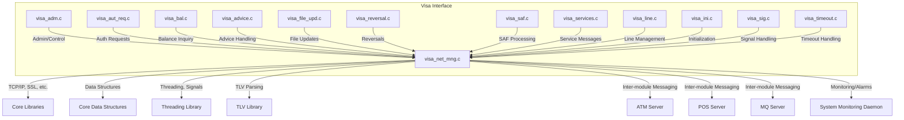
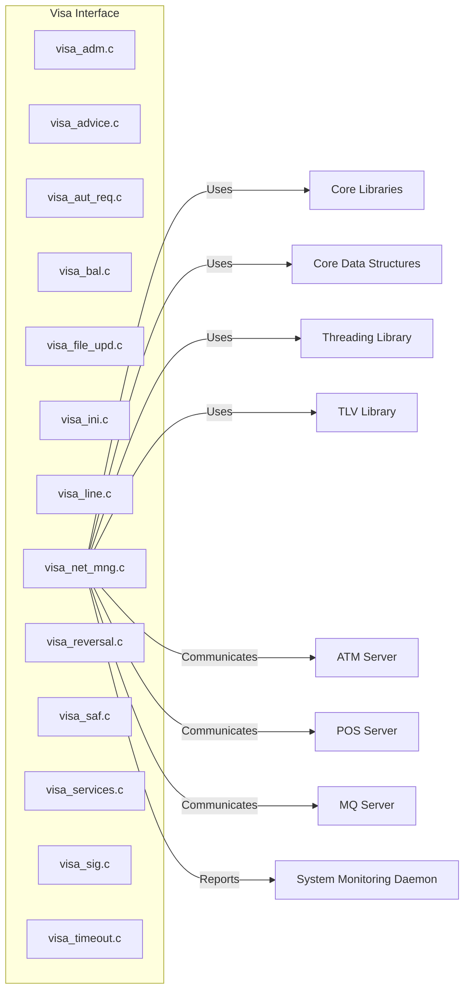

# Visa Interface Module Documentation

## Introduction

The **Visa Interface** module is a core component of the payment switching system, responsible for managing all interactions with the Visa network. It handles transaction authorization, balance inquiries, file updates, network management, reversals, and other Visa-specific message flows. The module ensures reliable, secure, and standards-compliant communication between the internal transaction processing system and the external Visa network.

## Core Functionality

The Visa Interface module provides the following key functionalities:

- **Authorization Requests**: Processes incoming and outgoing authorization requests to and from the Visa network.
- **Balance Inquiries**: Handles balance inquiry messages.
- **Advice and Reversal Handling**: Manages advice messages and transaction reversals.
- **File Updates**: Processes file update messages as per Visa specifications.
- **Network Management**: Maintains network connectivity, handles sign-on/sign-off, and manages network events.
- **SAF (Store and Forward)**: Ensures message delivery in case of temporary network failures.
- **Timeout and Signal Handling**: Manages timeouts and system signals for robust operation.

## Architecture Overview

The Visa Interface is composed of several specialized components, each implemented as a C source file. These components interact with each other and with shared system libraries to provide a complete Visa protocol implementation.

## Component Descriptions

### 1. visa_adm.c
Handles administrative and control messages, including configuration reloads and status queries.

### 2. visa_advice.c
Processes advice messages, which are notifications about transaction outcomes or status changes.

### 3. visa_aut_req.c
Manages authorization requests, including message formatting, sending, and response handling.

### 4. visa_bal.c
Handles balance inquiry messages to and from the Visa network.

### 5. visa_file_upd.c
Processes file update messages, such as key changes or parameter updates.

### 6. visa_ini.c
Responsible for module initialization, including signal set configuration and resource allocation.

### 7. visa_line.c
Manages communication lines, including connection establishment, monitoring, and recovery.

### 8. visa_net_mng.c
Central component for network management, including sign-on/sign-off, keep-alive, and error handling.

### 9. visa_reversal.c
Handles transaction reversal messages, ensuring failed or cancelled transactions are properly communicated.

### 10. visa_saf.c
Implements Store and Forward (SAF) logic for message queuing and retry in case of network issues.

### 11. visa_services.c
Processes service-related messages, such as echo tests and network status checks.

### 12. visa_sig.c
Handles system signals for graceful shutdown, reload, or other signal-driven events.

### 13. visa_timeout.c
Manages timeouts for message processing, network events, and retries.

## Data Flow and Process Flows

### Transaction Processing Flow

**Transaction Processing Flow:**

1. POS/ATM sends a transaction request to the Visa Interface.
2. Visa Interface forwards the request (authorization, balance, advice, etc.) to the Visa Network.
3. Visa Network responds with an approval, denial, or advice message.
4. Visa Interface delivers the response back to the POS/ATM.

**SAF (Store and Forward) Flow:**

1. Visa Interface attempts to send a message to the Visa Network.
2. If the network is down, the message is stored in the SAF Queue.
3. Visa Interface retries sending messages from the SAF Queue when the network is restored.
4. Upon successful delivery and acknowledgment, the message is removed from the SAF Queue.

## Dependencies and Integration

The Visa Interface module relies on several shared libraries and interacts with other system modules:

- **Core Libraries**: For TCP/IP, SSL/TLS communication ([see Core Libraries](Core Libraries.md))
- **Core Data Structures**: For message and account representations ([see Core Data Structures](Core Data Structures.md))
- **Threading Library**: For concurrency, signal, and timeout management ([see Threading Library](Threading Library.md))
- **TLV Library**: For parsing and constructing TLV-encoded Visa messages ([see TLV Library](TLV Library.md))
- **ATM Server, POS Server, MQ Server**: For upstream and downstream transaction flows ([see ATM Server](ATM Server.md), [see POS Server](POS Server.md), [see MQ Server](MQ Server.md))
- **System Monitoring Daemon**: For health checks and alarms ([see System Monitoring Daemon](System Monitoring Daemon.md))

## Component Interaction Diagram

## How Visa Interface Fits Into the Overall System

The Visa Interface acts as a bridge between the internal transaction processing environment and the external Visa network. It ensures:

- **Protocol Compliance**: All messages to/from Visa are formatted and validated per Visa standards.
- **Reliability**: Implements SAF and robust error handling for high availability.
- **Scalability**: Modular design allows for parallel processing of multiple transaction types.
- **Integration**: Seamlessly connects with other payment network interfaces (e.g., Base24, CUP, JCB) and core system modules.

For details on other network interfaces, see:
- [Base24 Interface](Base24 Interface.md)
- [CBAE Interface](CBAE Interface.md)
- [CIS Interface](CIS Interface.md)
- [CUP Interface](CUP Interface.md)
- [DCISC Interface](DCISC Interface.md)
- [Discover Interface](Discover Interface.md)
- [HSID Interface](HSID Interface.md)
- [IST Interface](IST Interface.md)
- [JCB Interface](JCB Interface.md)
- [MDS Interface](MDS Interface.md)
- [Postilion Interface](Postilion Interface.md)
- [Pulse Interface](Pulse Interface.md)
- [SID Interface](SID Interface.md)
- [SMS Interface](SMS Interface.md)
- [SMT Interface](SMT Interface.md)
- [UAESwitch Interface](UAESwitch Interface.md)

## References
- [Core Libraries](Core Libraries.md)
- [Core Data Structures](Core Data Structures.md)
- [Threading Library](Threading Library.md)
- [TLV Library](TLV Library.md)
- [ATM Server](ATM Server.md)
- [POS Server](POS Server.md)
- [MQ Server](MQ Server.md)
- [System Monitoring Daemon](System Monitoring Daemon.md)
