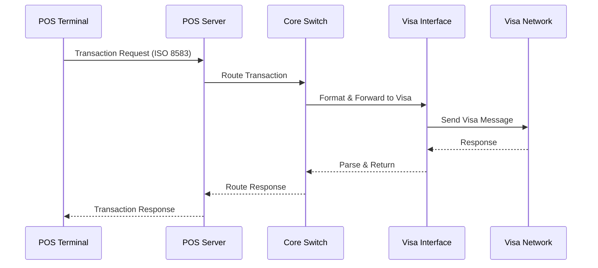

# pwc-unix_icpsconv Repository Overview

## Purpose

The `pwc-unix_icpsconv` repository is a comprehensive, modular payment switching and transaction processing platform for UNIX systems. It is designed to facilitate high-throughput, reliable, and standards-compliant financial transaction routing between internal systems (such as POS and ATM servers) and a wide array of external payment networks (Visa, MasterCard, CUP, JCB, Discover, Base24, CBAE, and more). The system supports multi-threaded processing, robust error handling, store-and-forward (SAF) mechanisms, and seamless integration with core banking and monitoring infrastructure.

Key features include:

- Multi-network protocol support (Visa, Base24, CBAE, CUP, JCB, etc.)
- Modular, thread-based architecture for scalability and maintainability
- Core libraries for networking, threading, and TLV (Tag-Length-Value) parsing
- Centralized data structures for transaction, account, and message representation
- Integration with ATM/POS servers, message queues, fraud detection, and system monitoring daemons

---

## End-to-End Architecture

The system is organized into several layers, each responsible for a specific aspect of transaction processing. The following diagrams illustrate the high-level architecture and module interactions.

### High-Level System Architecture

```mermaid
graph TD
    subgraph Core System
        A[Core Data Structures]
        B[Core Libraries]
        C[Threading Library]
        D[TLV Library]
    end
    subgraph Network Interfaces
        VI[Visa Interface]
        B24[Base24 Interface]
        CBAE[CBAE Interface]
        CIS[CIS Interface]
        CUP[CUP Interface]
        DCISC[DCISC Interface]
        DISC[Discover Interface]
        HSID[HSID Interface]
        IST[IST Interface]
        JCB[JCB Interface]
        MDS[MDS Interface]
        POST[Postilion Interface]
        PULSE[Pulse Interface]
        SID[SID Interface]
        SMS[SMS Interface]
        SMT[SMT Interface]
        UAE[UAESwitch Interface]
    end
    subgraph Servers & Daemons
        ATM[ATM Server]
        POS[POS Server]
        MQ[MQ Server]
        FRAUD[Fraud Daemon]
        SYSMON[System Monitoring Daemon]
    end

    VI -- uses --> A
    VI -- uses --> B
    VI -- uses --> C
    VI -- uses --> D
    B24 -- uses --> A
    B24 -- uses --> B
    B24 -- uses --> C
    B24 -- uses --> D
    CBAE -- uses --> A
    CBAE -- uses --> B
    CBAE -- uses --> C
    CBAE -- uses --> D
    %% ... similar for other interfaces

    ATM -- uses --> A
    ATM -- uses --> B
    ATM -- uses --> C
    POS -- uses --> A
    POS -- uses --> B
    POS -- uses --> C
    MQ -- uses --> A
    MQ -- uses --> B
    MQ -- uses --> C
    FRAUD -- uses --> A
    FRAUD -- uses --> B
    FRAUD -- uses --> C
    SYSMON -- uses --> A
    SYSMON -- uses --> B
    SYSMON -- uses --> C

    VI -- communicates --> ATM
    VI -- communicates --> POS
    VI -- communicates --> MQ
    B24 -- communicates --> ATM
    B24 -- communicates --> POS
    B24 -- communicates --> MQ
    %% ... similar for other interfaces

    SYSMON -- monitors --> VI
    SYSMON -- monitors --> B24
    SYSMON -- monitors --> CBAE
    %% ... similar for other interfaces
```



### Transaction Flow Example



---

## Repository Structure

The repository is organized into the following main components:

- **Network Interface Modules**: Each payment network (Visa, Base24, CBAE, CUP, etc.) has a dedicated interface module responsible for protocol-specific message handling, network management, and transaction processing.
- **Core Libraries**: Provide networking (TCP/IP, SSL/TLS), threading, and TLV parsing utilities used by all modules.
- **Core Data Structures**: Define canonical types for accounts, balances, banks, TLV, and more, ensuring consistency across the system.
- **Servers**: ATM Server, POS Server, and MQ Server handle incoming connections, transaction routing, and integration with external devices.
- **Daemons**: Fraud detection and system monitoring daemons provide security and operational oversight.

### Example Directory Structure

```
Source/
  src/
    interfaces/
      base1/           # Visa Interface
      base24/          # Base24 Interface
      cbae/            # CBAE Interface
      cup/             # CUP Interface
      ...              # Other network interfaces
    inc/               # Core Data Structures
    libs/
      libcom/          # Core Libraries (networking)
      libthr/          # Threading Library
      libtlv/          # TLV Library
    servers/
      atm/             # ATM Server
      pos/posiso_tdes/ # POS Server
      mq_srv/          # MQ Server
    daemons/
      daemon_fraud_V2/ # Fraud Daemon
      daemon_sysmon/   # System Monitoring Daemon
```

---

## Core Modules Documentation

Below are references to the documentation for the core modules and key interface components:

### Network Interface Modules

- [Visa Interface](Visa Interface.md)
- [Base24 Interface](Base24 Interface.md)
- [CBAE Interface](CBAE Interface.md)
- [CIS Interface](CIS Interface.md)
- [CUP Interface](CUP Interface.md)
- [DCISC Interface](DCISC Interface.md)
- [Discover Interface](Discover Interface.md)
- [HSID Interface](HSID Interface.md)
- [IST Interface](IST Interface.md)
- [JCB Interface](JCB Interface.md)
- [MDS Interface](MDS Interface.md)
- [Postilion Interface](Postilion Interface.md)
- [Pulse Interface](Pulse Interface.md)
- [SID Interface](SID Interface.md)
- [SMS Interface](SMS Interface.md)
- [SMT Interface](SMT Interface.md)
- [UAESwitch Interface](UAESwitch Interface.md)

### Core Libraries and Utilities

- [Core Data Structures](Core Data Structures.md)
- [Core Libraries](Core Libraries.md)
- [Threading Library](Threading Library.md)
- [TLV Library](TLV Library.md)

### Servers and Daemons

- [ATM Server](ATM Server.md)
- [POS Server](POS Server.md)
- [MQ Server](MQ Server.md)
- [Fraud Daemon](Fraud Daemon.md)
- [System Monitoring Daemon](System Monitoring Daemon.md)

---

## How to Use and Extend

- **Adding a New Network Interface**: Implement a new module under `Source/src/interfaces/`, following the architectural and threading patterns of existing interfaces.
- **Extending Data Structures**: Update or extend types in `Source/src/inc/` to support new transaction types or message formats.
- **Integrating with Core System**: Use the provided core libraries for networking, threading, and TLV parsing to ensure compatibility and maintainability.
- **Monitoring and Maintenance**: Leverage the System Monitoring Daemon for health checks and the Fraud Daemon for security oversight.

---

## Summary

The `pwc-unix_icpsconv` repository is a robust, extensible platform for payment transaction switching on UNIX systems. Its modular design, shared core libraries, and standardized data structures enable seamless integration with a wide range of payment networks and internal systems, supporting high reliability, scalability, and maintainability in demanding financial environments.